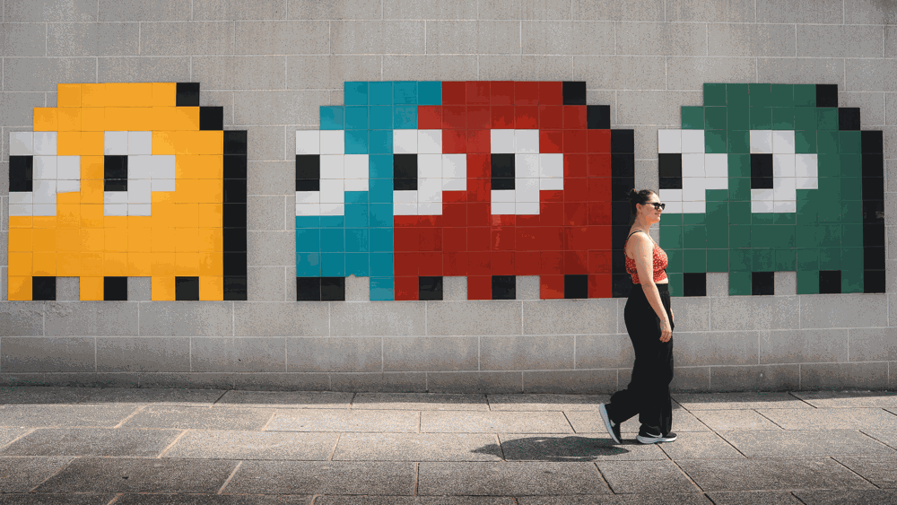

<div align="center">



# Playhub Artworks

### Your library, with the artwork it deserves.

Manage covers, banners, backgrounds, logos, and icons directly from Steam Big Picture, with a controller-friendly interface.

[](https://github.com/LoZazaMastro/Playhub)
[](LICENSE)

</div>

## All your artwork, in the right place

Playhub Artworks brings a complete library graphics manager to Gaming Mode. You can search, compare, and apply every element without returning to the desktop and without managing files manually.

- **Eight sources in a single interface:** SteamGridDB, PlayStation, Nintendo, Xbox, IGDB, AlphaCoders, iiDB, and IGN.
- **Source-consistent search:** each service uses its own results and available suggestions; IGDB and AlphaCoders also allow exact matching search.
- **All Steam formats:** covers, banners, backgrounds, logos, and icons, with filters shown only when they are actually supported.
- **Classic or square covers:** your chosen layout is applied across Home, Library, Game Info, and collections.
- **Perfect Hero and Perfect Banner:** background and logo are combined into a single high-resolution image, adjusting position, scale, opacity, and shadow from the gamepad.
- **ZazaMastro's Heroes:** when manually creating a Perfect Hero, you can also add a logo to the heroes published under LoZazaMastro's SteamGridDB username.
- **Bulk operations:** fill missing artwork, improve missing or low-resolution banners by bringing them to 920 × 430, regenerate covers, and restore original Steam assets.
- **Persistent choices:** layout, sources, and filters are remembered separately for each artwork type.

## How to use

To modify a single title, open the game options and choose **Playhub Artworks**. General preferences, the SteamGridDB key, and full-library bulk tasks can be found in the Decky quick access menu.

Bulk operations display progress and respect your configured exclusions. To undo changes managed by the plugin, you can use Steam's native artwork restoration tools.

## Requirements

- Windows;
- Steam in Big Picture mode;
- [Decky Loader](https://decky.xyz) 3.x;
- a personal [SteamGridDB API key](https://www.steamgriddb.com/profile/preferences/api) for searches and operations utilizing SteamGridDB.

The key is stored locally within the Decky data folder.

## Installation

You can install and update Playhub Artworks from the Plugin Store included in [Playhub](https://github.com/LoZazaMastro/Playhub), or manually:

1. download the ZIP published in the [Playhub repository](https://github.com/LoZazaMastro/Playhub);
2. enable Decky's developer mode;
3. open **Decky → Settings → Developer → Install plugin from ZIP**;
4. restart Decky or Steam when prompted.

## Development

```bash
pnpm install
pnpm run build
```

The frontend is generated in `dist/index.js`. The Python backend and provider integrations are located in `main.py` and `provider_search.py`.

## License and credits

Playhub Artworks is distributed under the [GNU GPL-3.0-or-later](LICENSE) license. The project originates from [decky-steamgriddb](https://github.com/SteamGridDB/decky-steamgriddb) and retains compatible parts of its scaffolding, certain helpers, and translations. Authors, derived components, and dependencies are documented in [NOTICE.md](NOTICE.md).

Artworks belong to their respective authors and owners. Steam and other mentioned trademarks belong to their respective owners.

<div align="center">

Created and maintained by **[LoZazaMastro](https://github.com/LoZazaMastro)**.

</div>
