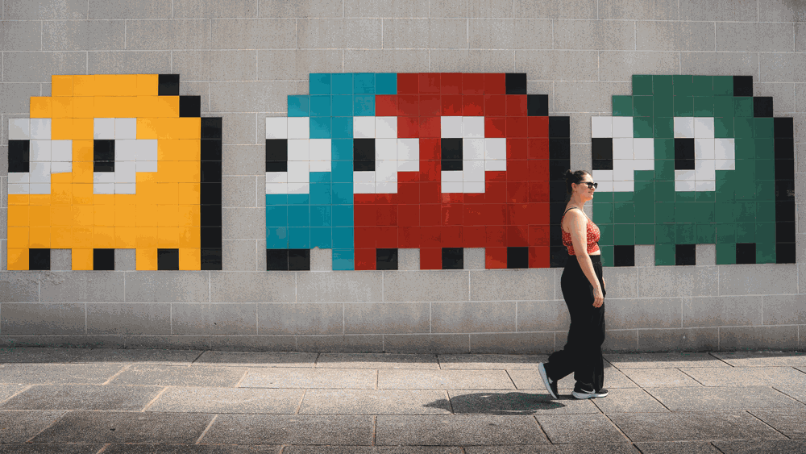

<div align="center">



# Playhub Artworks

### Your library, with the artwork it deserves.

Manage covers, banners, backgrounds, logos and icons directly from Steam Big Picture, with an interface built for your controller.

[](https://github.com/LoZazaMastro/Playhub)
[](LICENSE)

</div>

## Every artwork in its place

Find, compare and apply artwork without returning to the desktop or moving files by hand.

- **Eight sources in one place:** SteamGridDB, PlayStation, Nintendo, Xbox, IGDB, AlphaCoders, iiDB and IGN.
- **Source-aware search:** each service uses its own results and available suggestions. IGDB and AlphaCoders also support exact searches.
- **Every Steam artwork format:** covers, banners, backgrounds, logos and icons, with filters shown only where supported.
- **Portrait or square covers:** apply your preferred shape across Home, Library, game details and collections.
- **Your most recent game as a cover:** replace the wide first tile in Home's recent games with a cover that follows your selected shape.
- **Instant library scrolling:** move between rows without the animated scroll transition. You can also disable the alphabet selector that appears when holding a direction.
- **Perfect Hero and Perfect Banner:** combine a background and logo into one high-resolution image, adjusting position, scale, opacity and shadow with your controller.
- **ZazaMastro heroes:** when creating a Perfect Hero manually, you can also add a logo to heroes published under LoZazaMastro's SteamGridDB nickname.
- **Batch tools:** fill missing artwork, upgrade missing or low-resolution banners to 920 x 430, regenerate covers and restore Steam's original assets.
- **Remembered preferences:** shape, sources and filters are saved separately for each artwork type.

## Getting started

Open a game's options and choose **Playhub Artworks** to edit its artwork. General preferences, your SteamGridDB key and library-wide tools are available in Decky's Quick Access Menu.

Batch operations show their progress and respect your exclusions. Use the Steam artwork restore tools to undo supported changes made through the plugin.

## Requirements

- Windows.
- Steam Big Picture.
- [Decky Loader](https://decky.xyz) 3.x.
- A personal [SteamGridDB API key](https://www.steamgriddb.com/profile/preferences/api) for searches and operations that use SteamGridDB.

Your API key is stored locally in Decky's data folder.

## Installation

Install and update Playhub Artworks through the Plugin Store in [Playhub](https://github.com/LoZazaMastro/Playhub), or install it manually:

1. Download the installer ZIP from [Playhub Artworks releases](https://github.com/LoZazaMastro/Playhub-Artworks/releases).
2. Enable Decky's developer mode.
3. Open **Decky > Settings > Developer > Install plugin from ZIP** and select the ZIP.

## Version 1.1.6

Automatic Perfect Heroes now resolve usable logos from the current user's local artwork,
Steam's cached and official images, and multiple SteamGridDB candidates. Failed logo or
background candidates no longer silently produce a logo-free “completed” Perfect Hero.

Large static artwork is downloaded in bounded chunks, then recompressed/resized for Steam.
The source-file budget is separate from the output budget, including high-resolution and
16-bit PNGs. Transparent logos remain transparent; animated uploads are never silently
flattened. See [CHANGELOG.md](CHANGELOG.md) and [TESTING_1.1.6.md](TESTING_1.1.6.md).

After installing, fully restart Steam and Decky/Playhub so frontend and backend both use 1.1.6.
Saved preferences, exclusions and existing artwork are not reset by the upgrade.

### Regenerate all and Apply missing

**Regenerate all** now has two explicit phases. After confirmation, it first removes every
identified Perfect Hero in the eligible library batch, including manual compositions and
legacy ZazaMastro heroes, and clears saved background sources and completion markers. Only
when this cleanup pass finishes does it search for replacements and rebuild the heroes.
The progress display separately counts successfully removed Perfect Heroes.

If a replacement cannot be created, the old Perfect Hero stays removed: Steam falls back to
its normal background (where available) and the separate logo is restored. Cancellation does
not bring deleted compositions back. Covers, banners, icons, the actual logo files, game
associations and the API key are not deleted by this command. An unmarked ordinary custom
hero is not erased merely because no replacement can be found. Failed reset operations are
reported and block regeneration for that game rather than silently reusing its old state.

**Apply missing** remains non-destructive for intact existing Perfect Heroes, including
manual compositions without a logo. Installing this update does not run any cleanup by
itself. Earlier background-only false completions can be removed in one operation with
**Regenerate all**; removing each game manually is no longer necessary.

The startup fix also supports the reported Windows Decky runtime without `difflib`: a
bundled dependency-free title-similarity fallback is used only when the standard matcher
cannot be imported. No Python installation or extra runtime package is required for this fix.

## Development

```bash
pnpm install
pnpm run build
```

The supplied 1.1.6 archive was built with the reproducible offline path rather than Rollup.
With TypeScript installed locally or globally, `npm run test:offline` rebuilds all plugin
sources with the frozen, unchanged dependency runtime and runs Python/frontend tests.
The optional real-image suite is `npm run test:artwork-browser` and requires test-only Pillow,
Playwright and Chromium. It uses generated fixtures, not Steam account data or live downloads.
Changes to SCSS require the normal build above. See `tools/vendor/README.md` for provenance.

The frontend is built into `dist/index.js`. The Python backend and provider integrations are in `main.py` and `provider_search.py`.

## License and credits

Playhub Artworks is licensed under [GNU GPL-3.0-or-later](LICENSE). It is based on [decky-steamgriddb](https://github.com/SteamGridDB/decky-steamgriddb) and retains compatible parts of its scaffolding, helpers and translations. Authors, derived components and dependencies are documented in [NOTICE.md](NOTICE.md).

Artwork belongs to its respective creators and rights holders. Steam and other mentioned trademarks belong to their respective owners.

<div align="center">

Created and maintained by **[LoZazaMastro](https://github.com/LoZazaMastro)**.

</div>
